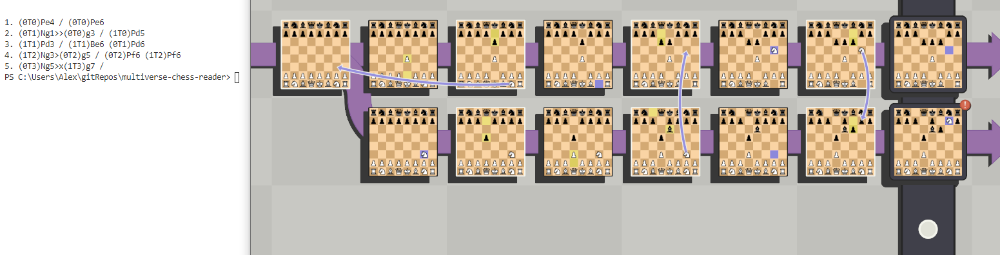

# Reading Game Data From 5dchess
This is a super WIP at the moment, more reverse engineering needs to be done and more code needs to be written.

# Usage
- Be on windows with the game open and some board visible
- run the program (cargo run)
- it should print out a bunch of stuff, at the bottom will be what it got for the moves that have been made

# Goals
- Save a game in a usable format to be given to other programs if desired
- Maybe be able to load games back into the program (this isn't even close to working at this point)

# Some notes
- This is some really really bad code, I'm pretty new to rust and also my own laziness has lead to everything being in main
- This currently only works on windows (because it has to get the memory offset for the 5dchess exe and I'm on a windows machine so that's the OS I supported)